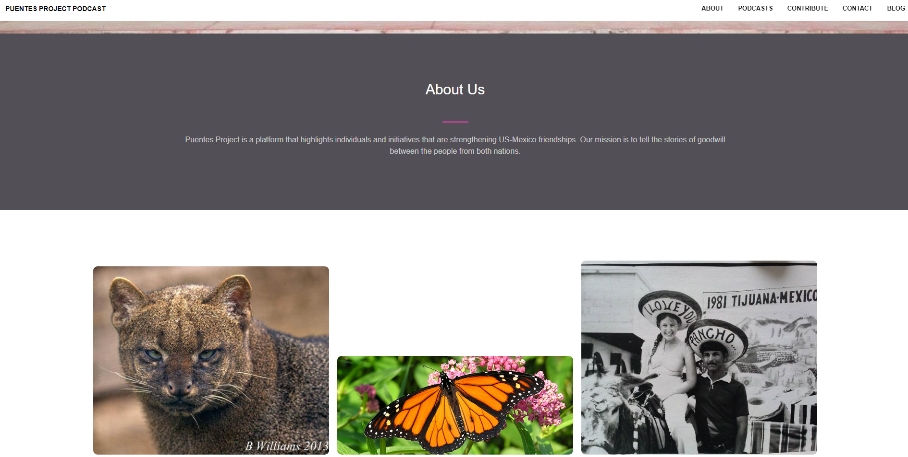

<br />
<div align="center">
	<a href="Repo Link">
		
	</a>
	<h3 align="center">Puente's-Project Podcast Site</h3>
	<p align="center">
    	Optimization and simplification of site used by the Puente's-Project Podcast
  	</p>
</div>

## About

Puentes Project was a platform that highlighted individuals and initiatives that strengthen US-Mexico relations. This repo is an optimized and simplified version of the [original site repo](https://github.com/Puentes-Project/Puentes-Project.github.io) used by the *Vagamundos Podcast* organization.

</br>
<div align="center"> <p> Vagamundos Podcast </p>  </div>


## Installation

1. Clone the repo
   ```sh
   git clone https://github.com/DarioArzaba/PuentesProjectSite
   cd PuentesProjectSite
   ```
3. Modify `index`, `main.js` and `main.css` files.

## Usage

You can see the original and the optimized version on the [organization repositories](https://github.com/Puentes-Project).

</br>
<div align="center"> <p> Website landing page top </p> </div>


</br>
<div align="center"> <p> Website featured </p> </div>


## License

Distributed under the [MIT License](https://mit-license.org/).

## Contact

Dario Arzaba - dario.arzaba@gmail.com